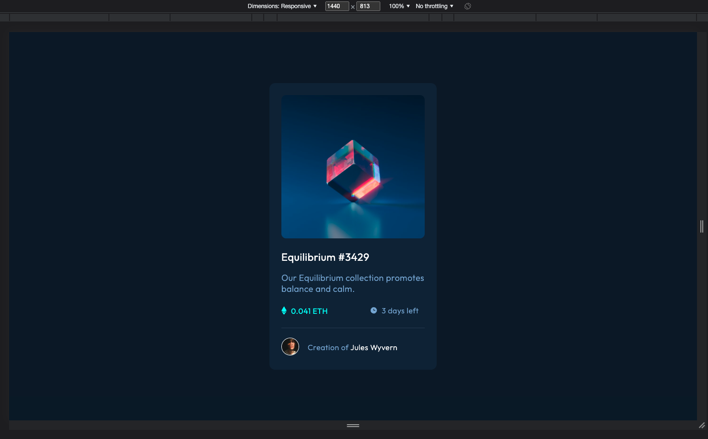
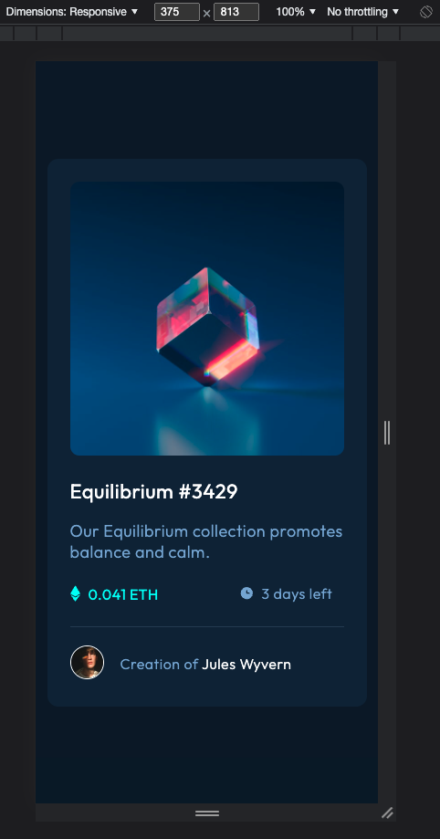

# Frontend Mentor - NFT preview card component solution

This is a solution to the [NFT preview card component challenge on Frontend Mentor](https://www.frontendmentor.io/challenges/nft-preview-card-component-SbdUL_w0U). Frontend Mentor challenges help you improve your coding skills by building realistic projects. 

## Table of contents

- [Overview](#overview)
  - [The challenge](#the-challenge)
  - [Screenshot](#screenshot)
  - [Links](#links)
- [My process](#my-process)
  - [Built with](#built-with)
  - [What I learned](#what-i-learned)
  - [Continued development](#continued-development)
  - [Useful resources](#useful-resources)
- [Author](#author)
- [Acknowledgments](#acknowledgments)

## Overview
  An NFT card built with HTML and CSS. The project includes both Desktop and Mobile versions.

### The challenge

Users should be able to:

- View the optimal layout depending on their device's screen size
- See hover states for interactive elements

### Screenshot

### Links

- Solution URL: [Solution URL](https://github.com/AlinaAlexandraVizireanu/nft-preview-card-component-main)
- Live Site URL: [Live Site URL](https://alinaalexandravizireanu.github.io/nft-preview-card-component-main/)

## My process
  I've build this card without using CSS Flexbox or CSS Grid to improve my CSS positioning skills.

### Built with

- Semantic HTML5 markup
- CSS custom properties

### What I learned
In the process of building this website I've improved my CSS positioning skills, using my knowledges regarding positioning elements absolute and relative, and also I've revsited the transform property.

### Continued development

I would like to coninue to build projects in this manner in order to improve my existing skills.

### Useful resources

- [MDN position](https://developer.mozilla.org/en-US/docs/Web/CSS/position) - This helped me to position the elements within the card.
- [MDN transform property](https://developer.mozilla.org/en-US/docs/Web/CSS/transform) - This is an amazing article which helped me finally understand the transform property. I'd recommend it to anyone still learning this concept.

## Author

- Website - [Alina Alexandra VIZIREANU](https://alinaalexandravizireanu.github.io/nft-preview-card-component-main/)
- Frontend Mentor - [@AlinaAlexandraVizireanu](https://www.frontendmentor.io/profile/AlinaAlexandraVizireanu)